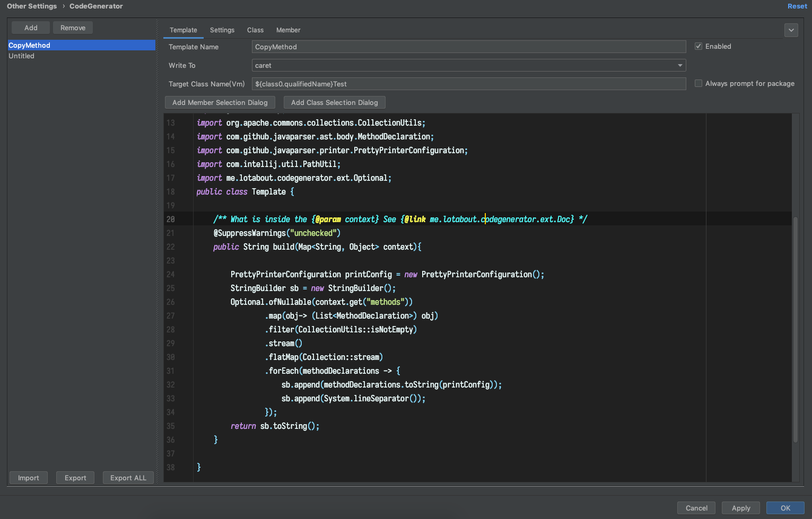
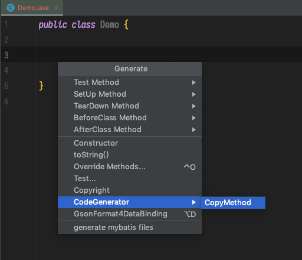
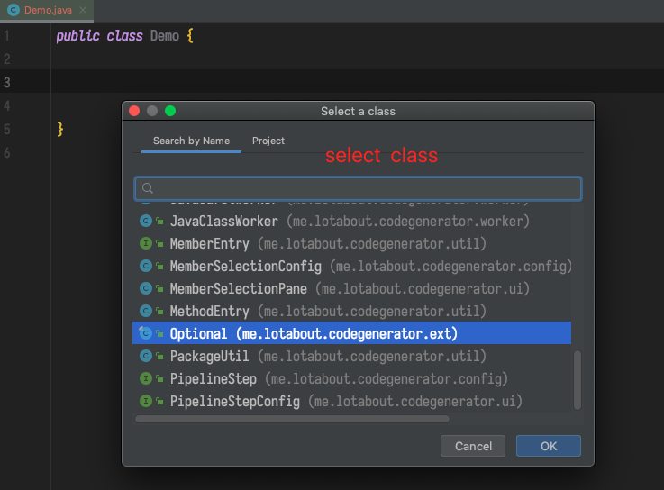
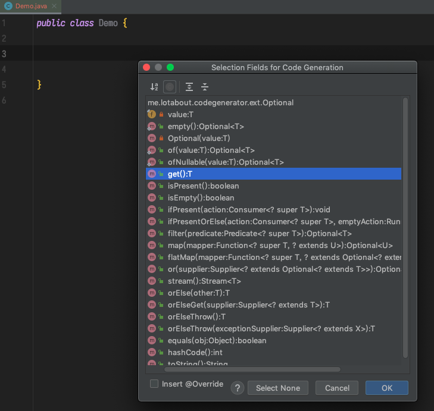
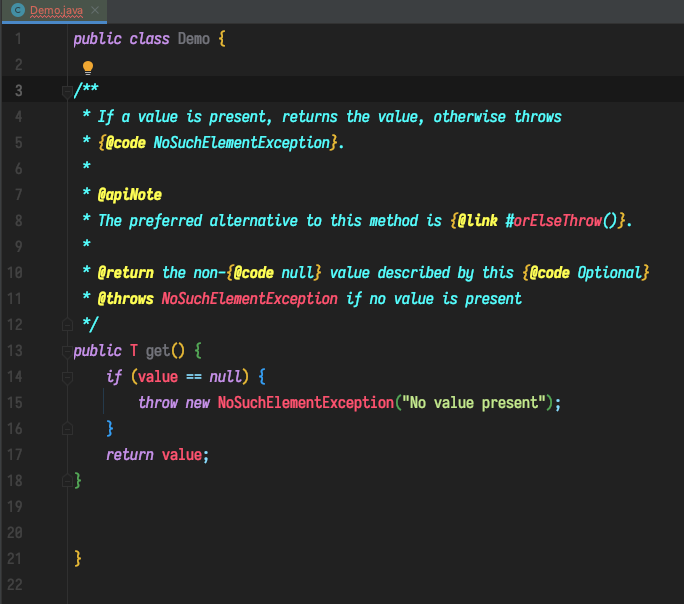

# CodeGenerator

用于生成代码的Idea插件  (魔改自 [lotabout/CodeGenerator](https://github.com/lotabout/CodeGenerator))

原来的插件让你写velocity模板生成Java代码，现在改造成写Java生成代码。

下面是一个复制方法的代码，让你选择某个类的某些方法，然后把这些方法复制到当前光标所在位置

